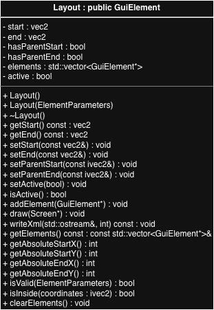
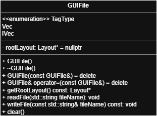

# SP26_Team02

# Quick Links to Classes
- [Event Class](#event)
- [ClickEvent Class](#clickevent)
- [ShowEvent Class](#showevent)
- [SoundEvent Class](#soundevent)
- [Sound Class](#sound)
- [SoundState Struct](#soundstate-struct)
- [SoundPlayer Class](#soundplayer)
- [ElementParameters Struct](#elementparameters-struct)
- [GuiElement Class](#guielement)
- [Factory Class](#factory)
- [Layout Class](#layout)
- [Triangle Class](#triangle)
- [Box Class](#box)
- [Line Class](#line)
- [Point Class](#point)
- [EventSystem Class](#eventsystem)
- [GuiFile XML Parser](#guifile)
- [Screen Class](#screen)
- [Matrix Class](#matrix)
- [vec2 (templated) Class](#vec2)
- [vec3 (templated) Class](#vec3)


# main.cpp

## Description

main.cpp is a demonstration program

---

# Event

## Description
`Event` is the primary class formulating the event-driven system. To handle events, an `Event*` trickled down from the root layout to 
each child element, calling `GuiElement::resolveEvent` to determine if the element can handle the `Event*` passed down.

Similar to `GuiElement` every event type implements this class, currently supporting these events:
- `ClickEvent`
- `ShowEvent`
- `SoundEvent`

## Data Members

### `EventType type`
This is an enum identifying the type of object passed down, useful in polymorphism

## Methods

### `Event()`
Default constructor

### `Event(EventType t)`
Constructs an `Event` object with type = t

### `Event(const Event& cp)`
Default copy constructor

### `operator=(const Event& rhs)`
Default = operator overload

### `virtual ~Event()`
Default destructor, virtual for polymorphism

### `EventType getType()`
Returns the `Event`'s `type`

# ClickEvent

## Description
`ClickEvent` represents a mouse click event, inheriting from `Event`. It contains the coordinates of the click to be used for event
handling in `GuiElement::resolveEvent`

## Data Members

### `int mouseX`
The x coordinate of the click

### `int mouseY` 
The y coordinate of the click

## Methods

### `ClickEvent(int x, int y)`
Constructor for `ClickEvent`. Sets `mouseX` to `x` and `mouseY` to `y`

### `int getMouseX()`
Returns the x coordinate of the click

### `int getMouseY()`
Returns the y coordinate of the click

# ShowEvent

## Description
`ShowEvent` represents an event to show or hide a `Layout`. It contains the name of the `Layout` to be shown or hidden and a `ShowActionType` to determine whether the `Layout` should be shown or hidden

## Data Members

### `std::string layoutName`
The name of the `Layout` to be shown or hidden

### `ShowActionType action`
An enum to determine whether the `Layout` should be shown or hidden. Can be `ShowActionType::SHOW` or `ShowActionType::HIDE`

## Methods

### `ShowEvent(std::string name)`
Constructor for `ShowEvent`. Sets `layoutName` to `layoutName` and `action` to `ShowActionType::SHOW` by default

### `ShowEvent(std::string name, ShowActionType act)`
Constructor for `ShowEvent`. Sets `layoutName` to `layoutName` and `action` to `act`

### `const std::string& getLayoutName()`
Returns the name of the `Layout` to be shown or hidden

### `ShowActionType getAction()`
Returns the `ShowActionType` of the event

# SoundEvent

## Description
`SoundEvent` represents an event to play, pause, or stop a sound. It contains the name of the sound and a `SoundActionType` to determine whether the sound should be played, paused, or stopped

## Data Members
### `std::string soundName`
The name of the sound to be played, paused, or stopped. Can be a file path or a sound name

### `SoundActionType action`
An enum to determine whether the sound should be played, paused, or stopped. Can be `SoundActionType::PLAY`, `SoundActionType::PAUSE`, or `SoundActionType::STOP`

### `bool loop = false`
A boolean to determine whether the sound should be looped or not when played. Loops when set to true

## Methods
### `SoundEvent(const std::string& name)`
Constructor for `SoundEvent`. Sets `soundName` to `name` and initializes `action` to `SoundActionType::PLAY` and `loop` to `false`

### `SoundEvent(const std::string& name, SoundActionType act, bool shouldLoop = false)`
Constructor for `SoundEvent`. Sets `soundName` to `name`, `action` to `act`, and `loop` to `shouldLoop`
- Allows the user to specify whether the sound should be looped when played

### `const std::string& getSoundName()`
Returns the name of the sound to be played, paused, or stopped

### `SoundActionType getAction()`
Returns the `SoundActionType` of the event

### `bool shouldLoop()`
Returns whether the sound should be looped when played or not

# Sound

## Description
A helper class for `SoundPlayer`. Used to store the data loaded from a WAV file for retrieval at a later time

---

## Data Members

### `std::string filePath`
The file path of the audio

---

### `Uint8* audioBuffer`
The audio's buffer data, created when the WAV file is loaded in

---

### `Uint32 audioLength`
The length of the object's `buffer` attributes in bytes

---

## Methods

### `Sound(Uint8* bufferData, Uint32 soundLength, std::string soundName)`
Class constructor. Sets `audioBuffer` to `bufferData`, `audioLength` to `soundLength`, and `filePath` to `soundName` 

---

### `~Sound()`
Default destructor

---

### `std::string getName()`
Returns the `filePath` attribute of this audio

---

### `Uint8* getBuffer()`
Returns the `buffer` attribute of this object, representing the audio's buffer data

---

### `Uint32 getLength()`
Returns the `length` attribute of this object, representing the length of the object's `buffer` attributes in bytes

---

# SoundState (struct)

## Description
A helper struct used to store WAV data in an easily modifiable format for audio playback. Used in `SoundPlayer`

---

## Data Members

### `std::string filePath`
The file path of an audio file. Retrieved to verify if an audio file is in `playback` of a `SoundPlayer`

---

### `Uint8* buffer`
The buffer data of an audio file

---

### `Uint32 audioLength`
The length of an audio file's buffer data in bytes

---

### `Uint8* bufferStart`
A copy of `buffer`. Used to reset the struct if an audio is set to loop

---

### `Uint32 originalLength`
A copy of `audioLength`. Used to reset the struct if an audio is set to loop

---

### `bool loop`
Sets whether an audio will loop or not. Loops when set to true

---

# SoundPlayer

## Description
`SoundPlayer` serves to handle the loading, conversion, and playback of WAV files in 44.1 kHz, monoaural, float 32-bit format
- Supports WAV files exclusively
- Loads file data into `Sound` objects for storage and `SoundState` structs for playback

---

## Data Members

### `SDL_AudioStream* stream`
A pointer to the stream object created by `SDL_OpenAudioDeviceStream()`
- Opened according to the formatting in `spec`
- Uses `streamLoader()` as the callback for playback

---

### `SDL_AudioSpec spec`
The specification for the audio stream
- Used to create the audio stream
- Used to convert WAV data to the same format as the stream
- Set to `SDL_AUDIO_F32` formatting, single channel, and 44.1 kHz frequency

---

### `std::vector<Sound> soundBank`
Storage for all loaded sounds. Stores `Sound` objects. Accessed when a sound is loaded or requested for playback

---

### `std::vector<SoundState> playback`
The playback queue for the callback function. `SoundState` objects are cleared from the vector when their data has been exhausted or reset to the beginning if the sound is set to loop

---

## Methods

### `SoundPlayer()`
Class constructor. Sets the specifications for audio playback, opens a new audio stream and begins playback
- Reports errors in stream creation or resuming playback

---

### `~SoundPlayer()`
Class destructor. Pauses playback, clears the soundbank and playback queue, and destroys the audio stream
- Reports errors in pausing playback

---

### `void togglePlayback()`
Toggles audio playback. Pauses if the stream is playing audio and resumes if the stream is paused
- Reports errors in pausing or resuming playback

---

### `bool loadSound(std::string filePath)`
Loads the desired file into the sound bank. Files must exist and be in WAV format
- Uses `SDL_LoadWAV()` and report errors
- Converts the loaded data to the formatting in the `spec` attribute using `SDL_ConvertAudioSamples()` and reports errors
- Creates a new `Sound` object and pushes it to `soundBank`

---

### `bool playSound(std::string filePath, bool loop)`
Pushes the desired file into `playback` as a `SoundState` struct. User can set a sound to loop using the `loop` argument
- Checks if the file exists in `soundBank`
  - If it does, the data is loaded into a `SoundState` struct
  - If not, `loadSound()` is called
  - Reports any errors in loading or playing sounds

---

### `bool stopSound(std::string filePath)`
Removes the requested audio from the `playback` queue. If the audio is not in `playback` then a corresponding message is shown

---

### `std::vector<Sound> getSoundBank()`
Returns the sound bank of `Sound` objects.
- Can be used to check what sounds exist at a given time

---

### `static void streamLoader(void* userData, SDL_AudioStream* stream, int amount, int x)`
The callback function for audio playback. Takes in `userData` as a reference to the `SoundPlayer` object and `stream` for the corresponding stream. Creates and deletes a mix array on each call
- `amount` represents the amount of data the stream needs
- `x` is unused, but required for compilation
- Iterates through `playback` and takes the minimum between the amount of data left in the audio and `amount`
  - If an audio is exhausted:
    - If `loop` is true, the audio is reset to the beginning of its buffer
    - If `loop` is false, the audio is cleared from `playback`
- Uses `SDL_MixAudio()` and `SDL_PutAudioStreamData()` to build and supply the mix array for the stream

---

# ElementParameters (struct)

## Description
A struct passed to `Factory` to create a `GuiElement` object. Members are set to default values (`false`, `nullptr`, `std::numeric_limits<int>::lowest()`) to allow validity checks
- Has a member for everything needed for all `GuiElement` objects
  - Objects will reference relevant members when being constructed

---

## Data Members

### `enum class TagType { Vec, IVec }`
Enumeration used to communicate whether the corresponding attribute is a float or integer mathematical vector

### `std::string name`
The desired name of the object

---

### `ivec2 point1`
The coordinates of the first point of an object
- Initialized to `ivec2(std::numeric_limits<int>::lowest(), std::numeric_limits<int>::lowest())`

---

### `ivec2 point2`
The coordinates of the second point of an object
- Initialized to `ivec2(std::numeric_limits<int>::lowest(), std::numeric_limits<int>::lowest())`

---

### `ivec2 point3`
The coordinates of the third point of an object
- Initialized to `ivec2(std::numeric_limits<int>::lowest(), std::numeric_limits<int>::lowest())`

---

### `ivec3 color`
The values for an object's color
- Initialized to `ivec3(std::numeric_limits<int>::lowest(), std::numeric_limits<int>::lowest(), std::numeric_limits<int>::lowest())`

---

### `Screen* screen`
A pointer to the `Screen` object the object should be drawn to
- Initialized to `nullptr`

---

### `ivec2 parentStart`
The coordinates that this object's parent starts at
- Initialized to `ivec2(std::numeric_limits<int>::lowest(), std::numeric_limits<int>::lowest())`

---

### `ivec2 parentEnd`
The coordinates that this object's parent ends at
- Initialized to `ivec2(std::numeric_limits<int>::lowest(), std::numeric_limits<int>::lowest())`

---

### `bool hasParentStart`
Indicates whether the object has (`true`) the starting point of its parent or not(`false`)
- Initialized to `false`

---

### `bool hasParentEnd`
Indicates whether the object has (`true`) the ending point of its parent or not(`false`)
- Initialized to `false`

---

### `std::vector<GuiElement*> elements`
A vector of `GuiElement` pointers used to set the children of a new `Layout` object

---

### `bool active`
Indicates whether a new `Layout` object is visible
- Initialized to `false`

---

### `TagType point1Type`
The type of mathematical vector that `point1` is. Can be `TagType::Vec` or `TagType::IVec`
- Initialized to `TagType::Vec`

---

### `TagType point2Type`
The type of mathematical vector that `point2` is. Can be `TagType::Vec` or `TagType::IVec`
- Initialized to `TagType::Vec`

---

### `TagType point3Type`
The type of mathematical vector that `point3` is. Can be `TagType::Vec` or `TagType::IVec`
- Initialized to `TagType::Vec`

---

### `TagType colorType`
The type of mathematical vector that `color` is. Can be `TagType::Vec` or `TagType::IVec`
- Initialized to `TagType::Vec`

---

### `vec2 layoutStart`
The relative starting position of a `Layout` object
- Initialized to `vec2(std::numeric_limits<float>::lowest(), std::numeric_limits<float>::lowest())`

---

### `vec2 layoutEnd`
The relative ending position of a `Layout` object
- Initialized to `vec2(std::numeric_limits<float>::lowest(), std::numeric_limits<float>::lowest())`

---

# GuiElement

## Description

`GuiElement` is the **base class for all drawable GUI primitives** in the system.

It defines a common interface used by all graphical objects such as:

- `Layout`
- `Point`
- `Line`
- `Box`
- `Triangle`

The class allows these derived types to be handled **polymorphically**, meaning they can be stored and manipulated using a `GuiElement*`.

Each element maintains a pointer to the `Screen` object where it will be rendered.

---

## Internal Data Structures

### `enum class guiElement`
This enumeration identifies the type of GUI element being created.  
It is primarily used by the **Factory** to determine which object to instantiate.

```cpp
enum class guiElement { LAYOUOT, POINT, LINE, BOX, TRIANGLE };
```

---

## Data Members

### `Screen* screen`  
Pointer to the `Screen` object where the element will be drawn.

### `ivec2 parentStart`
`ivec2` that stores the starting coordinates of the parent `GuiElement` (usually `Layout`)

### `ivec2 parentEnd`
`ivec2` that stores the ending coordinates of the parent `GuiElement` (usually `Layout`)

### `std::string name`
`string` that stores the name of the `GuiElement`

---

## Methods

### `GuiElement()`
Default constructor. Initializes the base GUI element.

---

### `~GuiElement()`
Destructor for the base GUI element class.
Derived classes inherit this destructor behavior.

---

### `void draw(Screen *screen)`
Virtual draw method intended to be **overridden by derived classes**.
Each derived class implements its own drawing behavior:

| Class | Screen Function Used |
|------|------|
| `Point` | `colorOnePixel()` |
| `Line` | `drawBresenhamLine()` |
| `Box` | `drawBox()` |
| `Triangle` | `drawTriangle()` |

In addition, calling `draw()` in a parent-type GUI Element (ex. `Layout`) will call `draw()` on all children of that parent

---

### `void writeXml(std::ostream& out) const`
Virtual method used for writing the GUI element to an XML layout file.
Derived classes override this method to write their specific geometry and color information.

---

### `virtual void GuiElement::setParentStart(const ivec2& start)`
Sets the `parentStart` data for the current `GuiElement` object

---

### `virtual void GuiElement::setParentEnd(const ivec2& end)`
Sets the `parentEnd` data for the current `GuiElement` object

---

### `virtual bool GuiElement::resolveEvent(Event* e)`
Handles an incoming event for the current `GuiElement` object

Returns:

- `true` if the element handles and consumes the event
- `false` if the element does not handle the event and propagation should continue

---

### `void setName(const std::string& n)`
Sets the `name` data for the current `GuiElement` object

---

### `ivec2 GuiElement::getParentStart()`
Returns the `parentStart` data for the current `GuiElement` object in `ivec2` format

---

### `ivec2 GuiElement::getParentEnd()`
Returns the `parentEnd` data for the current `GuiElement` object in `ivec2` format

---

### `const std::string& getName() const`
Returns the `name` data for the current `GuiElement` object

---

### `virtual bool isValid(ElementParameters ep)`
A pure virtual function. Implemented by inherited classes to ensure the data passed using `ep` is valid and can be used to create a new object

---

# Factory

## Description

The `factory()` function implements a **Factory Design Pattern** used to dynamically create GUI elements.

Instead of directly constructing objects like `new Line` or `new Box`, the program calls the factory and specifies which type of element is needed.

This provides:
- centralized object creation
- simplified parsing logic
- polymorphic object handling via `GuiElement*`

The factory returns a pointer to a `GuiElement`, allowing the caller to treat all shapes uniformly.

---

## Function

### `GuiElement* factory(guiElement e, ElementParameters ep)`
Creates a new GUI element based on the `guiElement` enum value.
- Passes `ep` struct to the corresponding object's constructor.
- Returns pointer to a newly allocated `GuiElement` object.
- Returns `nullptr` if the enum value does not match any supported element or if the constructor throws an exception due to invalid data.

---

## Supported Element Types

| Enum Value | Object Created |
|------|------|
| `guiElement::LAYOUT` | `Layout` |
| `guiElement::POINT` | `Point` |
| `guiElement::LINE` | `Line` |
| `guiElement::BOX` | `Box` |
| `guiElement::TRIANGLE` | `Triangle` |

---

## Example Usage

```cpp
GuiElement* element = factory(guiElement::LINE);
element->draw(&screen);
```

---

# Layout

## Description
`Layout` is the primary "parent-type" `GuiElement` that functions to nest elements within certain bounds. It inherits from the `GuiElement` class to not only align itself according to its parent's bounds, but also align its children according to its own bounds.
- `vec2 start`: The percentage of the `Layout`'s parent bounds to start this `Layout` at for `x` and `y` respectively
- `vec2 end`: The percentage of the `Layout`'s parent bounds to end this `Layout` at for `x` and `y` respectively
- `bool hasParentStart`: Boolean to check if the parent bounds have been set yet so that the `Layout` cannot draw otherwise
- `bool hasParentEnd`: Similar to `hasParentStart` but for ending coordinates too to ensure that all bounds are satisfied
- `std::vector<GuiElement*> elements`: Contains all elements nested within this `Layout`
- `bool active`: Display the `Layout` or not based on the boolean parameter

---

## Methods

### `Layout()`
The default constructor, which only initializes `active` to false for other data to be set at a later time

---

### `Layout(ElementParameters ep)`
Constructor that takes in an `ElementParameters` struct. Called via `Factory`
- Calls `isValid` on `ep`
  - Throws an exception if `isValid` returns `false`
- Checks if `ep.parentStart` or `ep.parentEnd` has been set
  - If so, sets the corresponding attribute in the new `Layout` object and sets `hasParentStart` or `hasParentEnd` to true
- Sets the `start`, `end`, `active`, and `naem` attributes based on the corresponding data from `ep`
- Calls `addElement` on all elements in `ep.elements` to add them to this object's child vector

---

### `~Layout`
The default destructor. Destroys not only the `Layout` but also all of the children that the `Layout` owns in `elements`

---

### `void setStart(const vec2& start)`
Sets the `start` to the starting percentage values for this `Layout`

---

### `void setStart(const vec2& start)`
Sets the `end` to the ending percentage values for this `Layout`

---

### `void setParentStart(const ivec2& start)`
Sets the parent starting coordinates as in `GuiElement` but overloaded to also set `hasParentStart` to `true` to signal that a starting bound has been added

---

### `void setParentEnd(const ivec2& end)`
Sets the parent ending coordinates as in `GuiElement` but overloaded to also set `hasParentEnd` to `true` to signal that an ending bound has been added

---

### `void setActive(bool value)`
Sets `active` to `value`, toggling the `Layout` active (able to be drawn) or not

---

### `void isActive()`
Getter method for `active` to check if the `Layout` can be drawn

---

### `void addElement(GuiElement *element)`
Adds `element` to `elements` as a child of this `Layout` and sets `element->parentStart` to the absolute starting position of this `Layout` and `element->parentEnd` to the absolute ending position of this `Layout`

---

### `void draw(Screen *screen)`
If the `Layout` is active and contains both starting and ending parent bounds, iterates through every `GuiElement*` in `elements` to call their individual `draw()` functions, drawing every child element

---

### `void writeXml(std::ostream& out)`
Similar to `draw()` except first printing the proper `<layout>` tag with parameters and then writing to an XML by calling each child `GuiElement*`'s `writeXml()` function.

---

### `bool resolveEvent(Event* e)`
Handles and propagates an event through this Layout’s hierarchy
- Checks for `SHOW` event to update current Layout state
- If `active == false`, stops immediately and returns `false`
- Otherwise, iterates through all child elements:
  - Calls `child->resolveEvent(e)`
  - Stops early if a child returns `true`
- Returns:
  - `true` → event was handled by a child  
  - `false` → event was not handled  

---

### `vec2 getStart()`
Returns starting coordinate percentages from `this->start`

---

### `vec2 getEnd()`
Returns ending coordinate percentages from `this->end`

---

### `const std::vector<GuiElement*>& getElements() const`
Returns a reference to `Layout`'s `elements` vector

---

### `int getAbsoluteStartX`
Returns the absolute starting **x** position of this `Layout`

---

### `int getAbsoluteStartY`
Returns the absolute starting **y** position of this `Layout`

---

### `int getAbsoluteEndX`
Returns the absolute ending **x** position of this `Layout`

---

### `int getAbsoluteEndY`
Returns the absolute ending **y** position of this `Layout`

---

### `bool isValid(ElementParameters ep)`
Checks whether `ep.layoutStart` or `ep.layoutEnd` have been set
- Returns false if `x` or `y` in `ep.layoutStart` or `ep.layoutEnd` have not been set

---

## UML Diagram


---

# Triangle

## Description
`Triangle` is a class used for storing and drawing a filled triangle to a `Screen` object. It inherits from the `GuiElement` class
- `ivec2 a`: the coordinates of the first point of the triangle
- `ivec2 b`: the coordinates of the second point of the triangle
- `ivec2 c`: the coordinates of the third point of the triangle
- `ivec3 color`: the color of the triangle
- `TagType aType`: the type of tag for the `a` attribute
- `TagType bType`: the type of tag for the `b` attribute
- `TagType cType`: the type of tag for the `c` attribute
- `TagType colorType`: the type of tag for the `color` attribute

---

## Methods

### `Triangle()`
The default constructor. Initializes `a`, `b`, `c`, and `color` to zeros

---

### `Triangle(ivec2 pointA, ivec2 pointB, ivec2 pointC, ivec3 color)`
The parameterized constructor. Assigns `pointA` to `a`, `pointB` to `b`, `pointC` to `c`, and `color` to `color

---

### `Triangle(ElementParameters ep)`
Constructor that takes in an `ElementParameters` struct. Called via `Factory`
- Calls `isValid` on `ep`
  - Throws an exception if `isValid` returns `false` to prevent the object from being created
- Sets the `a`, `b`, `c`, `color`, `aType`, `bType`, `cType`, `colorType`, and `name` attributes based on the corresponding data in `ep`

---

### `Triangle(const Triangle& cp)`
Copy assignment operator. Takes attributes from `cp` and creates a new `Triangle`

---

### `Triangle& operator=(const Triangle& cp)`
Assignment operator. Sets the current `Triangle`'s attributes equal to corresponding attributes from `cp`

---

### `bool operator==(Triangle rhs)`
Equality operator. Returns false if attributes from current `Triangle` do not match attributes for `rhs`

---

### `bool operator!=(Triangle rhs)`
Inequlity operator. Returns the inverse of the equality operator

---

### `~Triangle()`
The default destructor

---

### `void draw(Screen *screen)`
Method to draw the stored triangle to a `Screen` object
- Calls the `drawTriangle` within the `Screen` class to draw the box to to the screen's `SDL_Surface`

---

### `void setA(const ivec2& v, TagType t)`
Method to set the `a` and `aType` attributes of a `Triangle` object

---

### `void setB(const ivec2& v, TagType t)`
Method to set the `b` and `bType` attributes of a `Triangle` object

---

### `void setC(const ivec2& v, TagType t)`
Method to set the `c` and `cType` attributes of a `Triangle` object

---

### `void setColor(const ivec3& v, TagType t)`
Method to set the `color` and `colorType` attributes of a `Triangle` object

---

### `getA()`
Returns the `a` attribute of the triangle

---

### `getB()`
Returns the `b` attribute of the triangle

---

### `getC()`
Returns the `c` attribute of the triangle

---

### `void writeXml(std::ostream& out) const`
Writes the triangle to an XML layout file.

Behavior:
- Writes a `<triangle>` tag with the name parameter to the output stream
- Writes the three triangle vertices (`a`, `b`, `c`)
- Each vertex is written as either:
  - `<vec2>` if the stored `TagType` is `TagType::Vec`
  - `<ivec2>` if the stored `TagType` is `TagType::IVec`
- Writes the triangle color (`color`)
  - `<vec3>` if `TagType::Vec`
  - `<ivec3>` if `TagType::IVec`
- Closes the `<triangle>` tag

This allows the triangle to preserve whether the original data used floating-point (`vec`) or integer (`ivec`) values when writing the layout file.

---

### `bool isValid(ElementParameters ep)`
Checks whether `ep.point1`, `ep.point2`, and `ep.point3` have been initialized and whether `ep.color` is complete
- Returns false if `x` or `y` in `ep.point1`, `ep.point2`, or `ep.point3` have not been set
- Sets any missing color value to `125`

---

# Box

## Description
`Box` is a class used for storing and drawing a filled box to a `Screen` object. It inherits from the `GuiElement` class
- `vec2 min`: the coordinates of the minimum point of the box
- `vec2 max`: the coordinates of the maximum point of the box
- `vec3 color`: the color of the box
- `TagType minType`: the type of tag for the `min` attribute
- `TagType maxType`: the type of tag for the `max` attribute
- `TagType colorType`: the type of tag for the `color` attribute

---

## Methods

### `Box()`
The default constructor. Initializes `min`, `max`, and `color` to zeros

---

### `Box(vec2 min, vec2 max, vec3 color)`
The parameterized constructor. Assigns `min`, `max`, and `color` to appropriate attributes in the `Box` class

---

### `Box(ElementParameters ep)`
Constructor that takes in an `ElementParameters` struct. Called via `Factory`
- Calls `isValid` on `ep`
  - Throws an exception if `isValid` returns `false` to prevent the object from being created
- Sets the `min`, `max`, `color`, `minType`, `maxType`, `colorType`, and `name` attributes based on the corresponding data in `ep`

---

### `Box(const Box& cp)`
Copy assignment operator. Takes attributes from `cp` and creates a new `Box`

---

### `Box& operator=(const Box& cp)`
Assignment operator. Sets the current `Box`'s attributes equal to corresponding attributes from `cp`

---

### `bool operator==(Box rhs)`
Equality operator. Returns false if attributes from current `Box` do not match attributes for `rhs`

---

### `bool operator!=(Box rhs)`
Inequlity operator. Returns the inverse of the equality operator

---

### `~Box()`
The default destructor

---

### `void draw(Screen *screen)`
Method to draw the stored box to a `Screen` object
- Calls the `drawBox` within the `Screen` class to draw the box to to the screen's `SDL_Surface`

---

### `void setMin(const ivec2& v, TagType t)`
Method to set the `min` and `minType` attributes of a `Box` object

---

### `void setB(const ivec2& v, TagType t)`
Method to set the `max` and `maxType` attributes of a `Box` object

---

### `void setColor(const ivec3& v, TagType t)`
Method to set the `color` and `colorType` attributes of a `Box` object

---

### `void writeXml(std::ostream& out) const`
Writes the box to an XML layout file.

Behavior:
- Writes a `<box>` tag with the name parameter to the output stream
- Writes the minimum corner (`min`)
  - `<vec2>` if the stored `TagType` is `TagType::Vec`
  - `<ivec2>` if the stored `TagType` is `TagType::IVec`
- Writes the maximum corner (`max`)
  - `<vec2>` if the stored `TagType` is `TagType::Vec`
  - `<ivec2>` if the stored `TagType` is `TagType::IVec`
- Writes the box color (`color`)
  - `<vec3>` if `TagType::Vec`
  - `<ivec3>` if `TagType::IVec`
- Closes the `<box>` tag

This ensures the XML output preserves whether integer or floating-point vector tags were used.

---

### `bool isValid(ElementParameters ep)`
Checks whether `ep.point1` and `ep.point2` have been initialized and whether `ep.color` is complete
- Returns false if `x` or `y` in `ep.point1` or `ep.point2` have not been set
- Sets any missing color value to `125`

---

# Line

## Description
`Line` is a class used for storing and drawing a line to a `Screen` object. It inherits from the `GuiElement` class
- `vec2 start`: the coordinates of the starting point of the line
- `vec2 end`: the coordinates of the ending point of the line
- `vec3 color`: the color of the line
- `TagType startType`: the type of tag for the `start` attribute
- `TagType endType`: the type of tag for the `end` attribute
- `TagType colorType`: the type of tag for the `color` attribute

---

## Methods

### `Line()`
The default constructor. Initializes `start`, `end`, and `color` to zeros

---

### `Line(vec2 start, vec2 end, vec3 color)`
The parameterized constructor. Assigns `start`, `end`, and `color` to appropriate attributes in the `Line` class

---

### `Line(ElementParameters ep)`
Constructor that takes in an `ElementParameters` struct. Called via `Factory`
- Calls `isValid` on `ep`
  - Throws an exception if `isValid` returns `false` to prevent the object from being created
- Sets the `start`, `end`, `color`, `startType`, `endType`, `colorType`, and `name` attributes based on the corresponding data in `ep`

---

### `Line(const Line& cp)`
Copy assignment operator. Takes attributes from `cp` and creates a new `Line`

---

### `Line& operator=(const Line& cp)`
Assignment operator. Sets the current `Line`'s attributes equal to corresponding attributes from `cp`

---

### `bool operator==(Line rhs)`
Equality operator. Returns false if attributes from current `Line` do not match attributes for `rhs`

---

### `bool operator!=(Line rhs)`
Inequlity operator. Returns the inverse of the equality operator

---

### `~Line()`
The default destructor

---

### `void draw(Screen *screen)`
Method to draw the stored line to a `Screen` object
- Calls the `drawBresenhamLine` within the `Screen` class to draw the line to to the screen's `SDL_Surface`

---

### `void setStart(const ivec2& v, TagType t)`
Method to set the `start` and `startType` attributes of a `Line` object

---

### `void setEnd(const ivec2& v, TagType t)`
Method to set the `end` and `endType` attributes of a `Line` object

---

### `void setColor(const ivec3& v, TagType t)`
Method to set the `color` and `colorType` attributes of a `Line` object

---

### `void writeXml(std::ostream& out) const`
Writes the line to an XML layout file.

Behavior:
- Writes a `<line>` tag with the name parameter to the output stream
- Writes the starting point (`start`)
  - `<vec2>` if the stored `TagType` is `TagType::Vec`
  - `<ivec2>` if the stored `TagType` is `TagType::IVec`
- Writes the ending point (`end`)
  - `<vec2>` if the stored `TagType` is `TagType::Vec`
  - `<ivec2>` if the stored `TagType` is `TagType::IVec`
- Writes the line color (`color`)
  - `<vec3>` if `TagType::Vec`
  - `<ivec3>` if `TagType::IVec`
- Closes the `<line>` tag

This allows the line to maintain the same vector type used in the original layout file.

---

### `bool isValid(ElementParameters ep)`
Checks whether `ep.point1` and `ep.point2` have been initialized and whether `ep.color` is complete
- Returns false if `x` or `y` in `ep.point1` or `ep.point2` have not been set
- Sets any missing color value to `125`

---

# Point

## Description
`Point` is a class used for storing and drawing a point to a `Screen` object. It inherits from the `GuiElement` class
- `vec2 coords`: the coordinates of the point
- `vec3 color`: the color of the box
- `TagType coordsType`: the type of tag for the `coords` attribute
- `TagType colorType`: the type of tag for the `color` attribute

---

## Methods

### `Point()`
The default constructor. Initializes `coords` and `color` to zeros

---

### `Point(vec2 coords, vec3 color)`
The parameterized constructor. Assigns `coords` and `color` to appropriate attributes in the `Point` class

---

### `Point(ElementParameters ep)`
Constructor that takes in an `ElementParameters` struct. Called via `Factory`
- Calls `isValid` on `ep`
  - Throws an exception if `isValid` returns `false` to prevent the object from being created
- Sets the `coords`, `color`, `coordsType`, `colorType`, and `name` attributes based on the corresponding data in `ep`

---

### `Point(const Point& cp)`
Copy assignment operator. Takes attributes from `cp` and creates a new `Point`

---

### `Point& operator=(const Point& cp)`
Assignment operator. Sets the current `Point`'s attributes equal to corresponding attributes from `cp`

---

### `bool operator==(Point rhs)`
Equality operator. Returns false if attributes from current `Point` do not match attributes for `rhs`

---

### `bool operator!=(Line rhs)`
Inequlity operator. Returns the inverse of the equality operator

---

### `~Point()`
The default destructor

---

### `void draw(Screen *screen)`
Method to draw the stored point to a `Screen` object
- Calls the `colorOnePixel` within the `Screen` class to draw the point to to the screen's `SDL_Surface`

---

### `void setCoords(const ivec2& v, TagType t)`
Method to set the `coords` and `coordsType` attributes of a point object

---

### `void setColor(const ivec3& v, TagType t)`
Method to set the `color` and `colorType` attributes of a point object

---

### `void writeXml(std::ostream& out) const`
Writes the point to an XML layout file.

Behavior:
- Writes a `<point>` tag with the name parameter to the output stream
- Writes the point position (`coords`)
  - `<vec2>` if the stored `TagType` is `TagType::Vec`
  - `<ivec2>` if the stored `TagType` is `TagType::IVec`
- Writes the point color (`color`)
  - `<vec3>` if `TagType::Vec`
  - `<ivec3>` if `TagType::IVec`
- Closes the `<point>` tag

This ensures the XML output preserves whether integer or floating-point vector tags were used in the layout file.

---

### `bool isValid(ElementParameters ep)`
Checks whether `ep.point1` has been initialized and whether `ep.color` is complete
- Returns false if `x` or `y` in `ep.point1` has not been set
- Sets any missing color value to `125`

---


# EventSystem

## Description

`EventSystem` is a **centralized event manager** responsible for:

- Storing events in a queue  
- Providing controlled access to events  
- Propagating events through the GUI hierarchy  

It follows the **Singleton Design Pattern**, ensuring only one global instance exists during the program’s lifetime.

This system enables **event-driven programming**, where events are created, queued, and then dispatched to GUI elements for handling.

---

## Core Responsibilities

- Queue incoming events (`push`)
- Retrieve events in FIFO order (`poll`)
- Process and dispatch events (`processEvents`)
- Route events to the appropriate subsystem:
  - GUI system (layouts)
  - Audio system (`SoundPlayer`)
- Maintain a single global instance (`getInstance`)

---

## Internal Data Structures

### `SoundPlayer soundPlayer`

- Handles all audio-related events
- Responsible for:
  - Playing sounds
  - Stopping sounds
  - Managing playback state

### `std::queue<std::unique_ptr<Event>> eventQueue`

- Stores events in **FIFO (First-In, First-Out)** order  
- Uses `std::unique_ptr<Event>` to enforce **exclusive ownership**
- Ensures safe memory management (RAII)

---

## Design Patterns Used

### Singleton Pattern

- Only one `EventSystem` instance exists
- Constructor is private
- Copy/assignment disabled
- Accessed via `getInstance()`

### Event Queue Pattern

- Events are buffered before processing
- Decouples **event producers** from **event consumers**

---

## Methods

### `static EventSystem& getInstance()`

Returns the single global instance of `EventSystem`.

- Implements **Meyers Singleton**
- Instance is created on first call

---

### `void push(std::unique_ptr<Event> e)`

Adds a new event to the queue.

- Transfers ownership using `std::move`
- Prevents copying of events

**Example:**
```cpp
EventSystem::getInstance().push(std::make_unique<ClickEvent>(x, y));
```

### `std::unique_ptr<Event> poll()`

Retrieves and removes the next event from the queue.

Returns:

- `nullptr` if queue is empty  
- Otherwise, the next event (ownership transferred)

---

### `void processEvents(Layout* root)`

Processes all queued events and propagates them through the GUI.

---

#### Event Propagation Model

- Uses **top-down (trickling)** propagation:
  - Event starts at root `Layout`
  - Travels through child elements
  - Stops when consumed


---

### Example Usage

```cpp
EventSystem& system = EventSystem::getInstance();

// Push events
system.push(std::make_unique<ClickEvent>(100, 200));
system.push(std::make_unique<SoundEvent>("click.wav", SoundActionType::PLAY, false));

// Process events
system.processEvents(rootLayout);
```

---

### Layout Tree Structure

The GUI is represented as a tree:
```
Layout (root)
├── Layout
│   ├── Line
│   └── Box
├── Triangle
└── Point
```

- Every node is a `GuiElement`
- `Layout` nodes can contain children
- Leaf nodes are drawable primitives (`Line`, `Box`, `Point`, `Triangle`)
- We use recursive functions to mirror this hierarchy as `Layout`s can contain child `Layout`s

---

## Data Members

### `Layout* rootLayout`

- Pointer to the root layout of the GUI
- Owns the entire hierarchy
- All elements are stored within this layout tree
- `GUIFile` is responsible for deleting it

---

### Memory Management

Ownership is hierarchical:

- `GUIFile` owns `rootLayout`
- `Layout` owns all of its child elements

Deleting the root layout recursively deletes the entire GUI structure.

The class supports both floating-point vector tags (`<vec2>`, `<vec3>`) and integer vector tags (`<ivec2>`, `<ivec3>`).  
When reading, the parser records which tag type was used and stores that information in the element using a `TagType`.  
When writing, each element's `writeXml()` method outputs the correct tag type.


---

## XML Token Constants

The header defines constant strings representing all valid XML tokens:

### Layout Tags
- `<layout>`
- `</layout>`

---

### Element Tags
- `<line>`
- `</line>`
- `<box>`
- `</box>`
- `<point>`
- `</point>`

---

### Vector Tags
- `<vec2>`
- `<vec3>`
- `<ivec2>`
- `<ivec3>`

---

### Coordinate Tags
- `<x>`
- `<y>`
- `<z>`

Two arrays are used to validate XML structure:

- `OPENERS` → list of all opening tags
- `CLOSERS` → list of all closing tags

These are used by the parser to verify correct nesting.

---

## Supported XML Layout Format

```xml
<layout name="Layout1" sX="0" sY="0" eX="1" eY="1">
    <layout name="Layout2" sX="0.1" sY="0.1" eX="0.5" eY="0.5">
        <line name="">
            <vec2>
                <x>10</x>
                <y>20</y>
            </vec2>
            <vec2>
                <x>40</x>
                <y>60</y>
            </vec2>
            <vec3>
                <x>255</x>
                <y>0</y>
                <z>0</z>
            </vec3>
        </line>
    </layout>

    <triangle name="">
        ...
    </triangle>
</layout>
```

- Layouts include bounds as attributes:
- Both `<vec*>` and `<ivec*>` variants are supported.

---

# GUIFile

## Public Methods

### `GUIFile()`
Default constructor.
- Initializes `rootLayout` to `nullptr`

---

### `~GUIFile()`
Destructor.
- Calls `clear()` to free all owned memory

---

### `void clear()`
Deletes the entire layout tree.

```cpp
if (rootLayout != nullptr) {
    delete rootLayout;
    rootLayout = nullptr;
}
```

---

### `Layout* getRootLayout() const`
Returns the pointer to the root layout.

---

### `void setRootLayout(Layout* root)`
Sets a new root layout.
- Deletes the existing layout if one exists  
- Transfers ownership of `root` to `GUIFile`  

---

### `void readFile(const std::string& fileName)`
Reads an XML file and constructs the layout tree.
- Clears existing data  
- Opens the file  
- Reads the first tag  
- Verifies it is a valid `<layout ...>` tag  
- Calls the internal recursive parser  
- Stores the result in `rootLayout`  

---

### `void writeFile(const std::string& fileName) const`
Writes the layout tree to an XML file.
- Opens the output file  
- Verifies `rootLayout` exists  
- Calls:

```cpp
rootLayout->writeXml(out);
```
The layout recursively writes all children

---

## Internal Helper Functions

These functions are internal to `GUIFile.cpp` and are not part of the public interface.
They implement the parsing logic used by `readFile()`.

---

### `Layout* parseLayout(std::ifstream& inFile, const std::string& layoutOpenTag)`
Parses a `<layout ...>` tag and its contents.
- Creates a new `ElementParameters` struct to hold data before `Layout` creation
- Reads layout attributes:
  - `sX`, `sY`  
  - `eX`, `eY`  
- Recursively parses:
  - child layouts  
  - child elements  
- - Creates and returns a new `Layout` object using the factor and `ElementParameters` struct

#### Additional Parsing Details

- Uses helper functions (`parseVec2`, `parseIVec2`, `parseVec3`, `parseIVec3`) to read vector data  
- These helpers ensure all required components (`x`, `y`, `z`) are present  
- If any component is missing or malformed, parsing fails immediately  

---

### `GuiElement* parseElement(std::ifstream& inFile, const std::string& elementOpenTag)`
Parses a drawable GUI element.
Supports:
- `Point`  
- `Line`  
- `Box`  
- `Triangle`  

Behavior:
- Determines type from opening tag
- Creates a new `ElementParameters` struct to hold data before object creations
- Extracts and sets the element `name` attribute
- Parses coordinate and color data
- Stores tag type (vec vs ivec)
- Uses vector parsing helpers
- Preserves original tag types for XML output
- Uses the Factory to create the object with the `ElementParameters` struct and returns the new `GuiElement` if it is created

---

## Attribute Parsing Helpers

These functions extract attribute values from XML tags.

---

### `bool getStringAttribute(const std::string& tag, const std::string& attrName, std::string& value)`

Extracts a string attribute from a tag.

#### Steps:

* Builds a search key:

  ```cpp
  attrName + "=\""
  ```
* Finds the start of the attribute inside the tag
* Locates the closing `"`
* Extracts the substring between them

#### Returns:

* `true` → attribute found and successfully parsed
* `false` → attribute not found or malformed


---

### `bool setNameFromTag(const std::string& tag, ElementParameters* ep)`

Extracts and assigns the `name` attribute to a `ElementParameter`'s `name` attribute

#### Steps:

* Calls:

  ```cpp
  getStringAttribute(tag, "name", name)
  ```
* If successful:

  ```cpp
  element->setName(name);
  ```
* Returns success/failure

#### Purpose:

* Avoids repeating name-parsing logic across multiple element types
* Centralizes enforcement of the required `name` attribute

---

### `bool getFloatAttribute(const std::string& tag, const std::string& attrName, float& value)`

Extracts a floating-point attribute from a tag.

#### Steps:

* Calls `getStringAttribute(...)` to retrieve the value as a string
* Converts it using:

  ```cpp
  std::stof(strValue);
  ```

#### Returns:

* `true` → attribute exists and conversion succeeded
* `false` → attribute missing or invalid

#### Used for:

* Layout attributes:

  * `sX`, `sY`
  * `eX`, `eY`


## Error Handling

If malformed XML is detected:

- `"Malformed XML"` is printed  
- Partially created objects are deleted  
- Parsing stops immediately  

### Examples of malformed XML

- Missing layout attributes  
- Mismatched tags  
- Missing coordinates  
- Invalid nesting  
- Missing vector components  
- Unexpected tags  

---


## Internal Parsing Utilities

Used during parsing:

- `trim()` → removes whitespace  
- `getNextTag()` → reads next XML tag  
- `getNextPayload()` → reads text between tags  
- `getFloatAttribute()` → extracts float attributes
- `getStringAttribute()` → extracts string attributes
- `setNameFromTag()` → assigns element names  
- `isLayoutOpen()` / `isLayoutClose()` → layout tag checks  
- `isElementOpen()` → element detection  
- `isMatchingElementClose()` → validates closing tags
- `determineGuiElementOpenerType()` → maps XML tags to `guiElement` enum  
- `parseVec2()` → parses `<vec2>` data and validates structure  
- `parseIVec2()` → parses `<ivec2>` integer vector data  
- `parseVec3()` → parses `<vec3>` data with x, y, z components  
- `parseIVec3()` → parses `<ivec3>` integer vector data    

---

## Type Conversion Helpers

Used to convert between float and integer vector types:

- `toIVec2(const vec2&)`  
- `toIVec3(const vec3&)`  
- `toVec2(const ivec2&)`  
- `toVec3(const ivec3&)`  
- `toInt(float)`  

These ensure the correct internal representation while preserving original XML tag types.

---
 

## UML Diagram


---

# Screen

## Description
`Screen` is a class representing an SDL_Surface with methods to draw to and color pixels on the surface. The surface can then be displayed using an SDL_Window.
- `uint32_t width, height`: The width and height of the surface
- `SDL_Surface* surface`: Holds a pointer to the SDL_Surface object

## Methods

### `blitTo(SDL_Surface* target) const`
Blits the current Screen object to the target surface
- Takes in pointer to an SDL_Surface as the target to blit to
- Verifies target surface exists
- Uses `SDL_BlitSurface` to blit between surfaces

### `colorOnePixel(const Tvec2<T1> coords, const Tvec3<T2> colors, ivec2 parentStart, ivec2 parentEnd)`
Colors target pixel in object's SDL_Surface
- Uses a 2D mathematical vector object to hold target pixel's X and Y components
- Uses a 3D mathematical vector object to hold target pixel's color value in RGB format (clamped between 0 and 255)
- Uses `SDL_MapRGBA` to convert the color to the pixel
- Will only draw if the pixel falls within the bounds of the Screen as well as the `parentStart` and `parentEnd` coordinates passed from a drawable object's `Layout` object

### `drawBox(Tvec2<T1> min, Tvec2<T1> max, Tvec3<T2> colors, ivec2 parentStart, ivec2 parentEnd)`
Draws a box on the target Screen object's SDL_Surface
- Uses 2D mathematical vectors to store the minimum and maximum coordinates for the box
- Clamps minimum and maximum X and Y values between 0 and the Screen object's height/width values
- Uses 3D mathematical vector to store the target color for the box
- Calls `colorOnePixel` for each coordinate in the bounds of the box in a double nested for loop as long as the coordinate falls within the `parentStart` and `parentEnd` coordinates passed from the Box's `Layout` object

### `pointInTriangle(ivec2 pointA, ivec2 pointB, ivec2 pointC, ivec2 pointP)`
Determines if `pointP` is within the bounds of the triangle established by `pointA`, `pointB`, and `pointC`
- Calculates the cross products AP x AB, BP x BC, & CP x CA
- If no conflicting signs exist between these three cross products, `point` is inside the triangle, else it is not

### `drawTriangle(ivec2 pointA, ivec2 pointB, ivec2 pointC, ivec3 color, ivec2 parentStart, ivec2 parentEnd)`
Draws a triangle on the target Screen object's SDL_Surface
- Computes a bounding box around the triangle using the min and max of the corners' x & y values
- Iterates over all points in the box & uses pointInTriangle to determine if the current point is in the triangle
- Calls `colorOnePixel` for each coordinate in the bounds of the triangle 

### `drawBresenhamLine(ivec2 start, ivec2 end, ivec3 color, ivec2 parentStart, ivec2 parentEnd)`
Draws a line to the Target Screen object's SDL_Surface using the Bresenham algorithm
- Uses 2D mathematical vectors to store the start and end points of the line
- Will only draw on pixels that exist in the surface
- Calls `colorOnePixel` for each pixel that exists on the line

### `clear(ivec3 color)`
Clears the Target Screen object's `SDL_Surface` by filling the entire surface with the given color
- Uses `drawBox` to draw a filled rectangle from `(0, 0)` to `(width, height)`
- Overwrites all previously drawn pixels in the surface
- Intended to be called at the start of each frame before drawing new elements

### `SDL_Surface* getSurface()`
Returns the surface for comparisons

### `uint32_t getHeight()`
Returns the height stored in the Screen object

### `uint32_t getWidth()`
Returns the width stored in the Screen object

### `bool surfaceEqual(const SDL_Surface* rhs)`
Compares the current Screen's SDL_Surface with the target SDL_Surface
- Uses `memcmp` to compare the memory of the two surfaces
- Returns false if either surface does not exist or is not equal, true otherwise

### `Screen()`
Default constructor. Initializes `width` and `height` to 0

### `Screen(uint32_t w, uint_32 h)`
Constructor that takes in values for width and height. Calls SDL_CreateSurface to create an SDL_Surface for the object
- Calls drawBox() to fill the entire screen with a black box as a way of clearing garbage values

### `Screen(const Screen& cp)`
Copy constructor. Creates a new Screen with the same values as `cp`
- Calls `cp.blitTo(this->surface)` to blit existing surface to the new surface

### `Screen& operator=(const Screen& cp)`
Copy assignment operator. Replaces Screen object's values with values from `cp`.
- Calls `cp.blitTo(this->surface)` to blit existing surface to the new surface

### `bool operator==(const Screen rhs)`
Compares two Screen objects
- Compares Screen widths and heights
- Calls surfaceEqual to check surface equality
- Returns false if any checks fail, true otherwise

### `~Screen()`
Destructor method. Checks if Screen object has a valid SDL_Surface before calling `SDL_DestroySurface`

---

# Matrix

## Description

`Matrix` is a 2D array of floats:
- `MATRIX_MAX` defined to be 3, used for both dimensions
- `float matrix[MATRIX_MAX][MATRIX_MAX]`
- `x[a][c]` is defined to be a float
    - *Note: Bracket access is not a public method

---

## Methods

### `Matrix()`
Matrix constructor. Initializes all elements to 0 using list initialization

---

### `Matrix(float _data[MATRIX_MAX][MATRIX_MAX])`
Creates a new Matrix object with floats stored in 2D _data array
- Uses a nested for loop to assign corresponding elements from `_data` to `components` array

---

### `Matrix(const Matrix& cp)`
Copy constructor. Places values in `components` with values from Matrix `cp`
- Uses a nested for loop to assign corresponding elements from `cp.components` to `components`

---

### `Matrix& operator=(const Matrix& cp)`
Replaces values in target Matrix's `components` with values from `cp.components`
- If target Matrix and Matrix cp are equal, this function immediately returns
- Uses a nested for loop to assign corresponding elements from `cp.components` to `components`

---

### `bool operator==(Matrix rhs)`
Checks Matrices for equality
- Uses a nested for loop to check target Matrix's values against corresponding values in Matrix rhs
- Returns false immediately if any values do not match between Matrices
- Returns true if nested for loops cycle through entire Matrix

---

### `bool operator!=(Matrix rhs)`
Returns the inverse of operator==
- Negates operator== in implementation
- Refer to operator== documentation for description of funtionality

---

### `Matrix operator*(Matrix rhs)`
Performs matrix multiplication with the target matrix on the left hand side and Matrix rhs on the right hand side, returning a Matrix
- Creates a vec3 for each row and column to utilize existing dot() functionality defined in vec3.hpp
- Performs dot product between each row and column according to the steps of matrix multiplication
- Creates a temporary 2D array of floats before returning a Matrix

---

### `Matrix transpose()`
Returns the transpose of target Matrix as a Matrix
- Creates a temporary 2D array of floats before returning a Matrix

---

# vec2

## Description

`vec2` is a 2D mathematical vector storing:

- `x` component (`float`)
- `y` component (`float`)

`ivec2` is the integer specialization of `vec2`, storing:

- `x` component (`int`)
- `y` component (`int`)

---

## Methods

### `Tvec2()`
Default constructor. Initializes both components to zero and binds `x` and `y` as references to the underlying `components` array.
- Initializes `components` to `{0, 0}`
- Sets `x` to alias `components[0]`
- Sets `y` to alias `components[1]`

---

### `Tvec2(const Tvec2& cp)`
Copy constructor. Creates a new vector with the same component values as `cp`.
- Uses constructor delegation to run the default constructor first
- Copies `cp.x` and `cp.y` into this vector

---

### `Tvec2(T _x, T _y)`
Value constructor. Creates a new vector with the given `x` and `y` component values.
- Uses constructor delegation to run the default constructor first
- Assigns `_x` to `x` and `_y` to `y`

---

### `Tvec2& operator=(const Tvec2& cp)`
Copy assignment operator. Replaces this vector’s component values with `cp`’s component values.
- Self-assignment safe (checks `this == &cp`)
- Copies `cp.x` and `cp.y`
- Returns `*this` to allow chaining

---

### `T dot(Tvec2 rhs)`
Computes the dot product between this vector and `rhs`, returning the dot product value.

---

### `T mag()`
Computes and returns the Euclidean magnitude (length) of the vector.

---

### `Tvec2 unit()`
Returns the unit (normalized) vector pointing in the same direction as this vector.
- If the magnitude is zero, this will divide by zero (undefined behavior).

---

### `T cross(Tvec2 rhs)`
Computes the cross product between the current vector & the `rhs` vector
- The scalar cross product as type `T`

---

### `bool operator==(Tvec2 rhs)`
Checks component-wise equality with `rhs`.
- `true` if `x == rhs.x` and `y == rhs.y`, otherwise `false`

---

### `bool operator!=(Tvec2 rhs)`
Checks component-wise inequality with `rhs`.
- `true` if at least one component differs, otherwise `false`

---

### `T& operator[](int index)`
Provides mutable access to a vector component using array-style indexing.
- `index == 0` accesses `x`
- `index == 1` accesses `y`
- Because this function returns a reference (`T&`), the returned component can be modified (e.g., `v[0] = 5;`).
- If `index` is out of range, this implementation prints an error message and terminates the program.

---

### `Tvec2& operator+=(Tvec2 rhs)`
Adds `rhs` to this vector (component-wise) and returns the modified vector.

---

### `Tvec2 operator+(Tvec2 rhs)`
Returns a `Tvec2` of the component-wise sum of this vector and `rhs` in `(*this + rhs)`.

---

### `Tvec2& operator*=(T scalar)`
Multiplies this vector by a scalar and returns the modified vector.

---

### `Tvec2 operator*(T scalar)`
Returns the `Tvec2` result of scalar multiplication.

---

### `Tvec2& operator-=(Tvec2 rhs)`
Subtracts `rhs` from this vector (component-wise) and returns the modified vector.

---

### `Tvec2 operator-(Tvec2 rhs)`
Returns the component-wise difference of this vector and `rhs`.

---

## Template Specializations (`T = int`)
The following member functions are explicitly specialized for `Tvec2<int>` (i.e., `ivec2`) to preserve integer return types while performing floating-point calculations internally.

---

### `int ivec2::mag()`
Computes the Euclidean magnitude of the integer vector and returns the result rounded to the nearest integer.
- Computes the magnitude using `std::sqrt`
- Rounds the result using `std::round`
- Casts the result to `int` using `static_cast<int>`
- Uses `inline` to prevent multiple definition errors when included in header files.

---

### `ivec2 ivec2::unit()`
Returns the unit vector of an integer vector with each component rounded to the nearest integer.
- Computes the integer magnitude using the specialized `mag()`
- Divides each component by the magnitude
- Rounds each result using `std::round`
- Casts each component to `int`
- If the magnitude is zero, this results in division by zero (undefined behavior).
- Because integer vectors cannot exactly represent most normalized vectors, rounding is required.

---

# vec3

## Description
`vec3` is a 3D mathematical vector storing:
- `float components[3]`
with
- `x`: `components[0]` (`float&`)
- `y`: `components[1]` (`float&`)
- `z`: `components[2]` (`float&`)

`ivec3` is a 3D mathematical vector storing:
- `int components[3]`
with
- `x`: `components[0]` (`int&`)
- `y`: `components[1]` (`int&`)
- `z`: `components[2]` (`int&`)

---

## Methods

### `Tvec3()`
Initializes components to [0,0,0] & binds `x`, `y`, & `z` as references to the underlying `components` array.

---

### `Tvec3(const Tvec3& cp)`
Creates a new Tvec3 with the same component values as `cp` via copying `cp.x` to `x` & `cp.y` to `y`

---

### `Tvec3(T _x, T _y, T_z)`
Creates a new Tvec3 with component values [`_x`, `_y`, `_z`]

---

### `Tvec3& operator=(const Tvec3& cp)`
Replaces the current vector's components with `cp`'s components

---

### `T dot(Tvec3 rhs)`
Computes the dot product of the current vector with `rhs`

---

### `T mag()`
Computes the magnitude of the current vector

---

### `Tvec3 unit()`
Constructs a unit vector from the current vector, returning this unit vector

---

### `Tvec3 cross(Tvec3 rhs)`
Computes the cross product between the current vector and `rhs`, returning a new `Tvec3` whose components correspond to the cross product's output

---

### `bool operator==(Tvec3 rhs)`
Checks if each component of the current vector is equal to each component of `rhs` respectively, returning true if so or false if not

---

### `bool operator!=(Tvec3 rhs)`
Checks if any component of the current vector is equal to the respective component of `rhs`, returning true if so or false if not

---

### `T& operator[](int index)`
Allows for random indexing of `components` by returning a reference to the value in `components` at `index`

---

### `Tvec3& operator+=(const Tvec3& rhs)` 
Adds `rhs.x`, `rhs.y`, & `rhs.z` to current vector's `x`, `y`, & `z` respectively, returning a reference to the current vector

---

### `Tvec3 operator+(const Tvec3& rhs)` 
Completes the same computation as the `+=` overload but returns a copy of the current vector after addition without changing the current vector's values

---

### `Tvec3& operator*=(T scalar)` 
Multiplies the current vector's `x`, `y`, & `z`, each by `scalar`, returning a reference to the current vector

---

### `Tvec3 operator*(const Tvec3& rhs)` 
Completes the same computation as the `*=` overload but returns a copy of the current vector after scalar multiplication without changing the current vector's values

---

### `Tvec3& operator-=(const Tvec3& rhs)` 
Subtracts `rhs.x`, `rhs.y`, & `rhs.z` from current vector's `x`, `y`, & `z` respectively, returning a reference to the current vector

---

### `Tvec3 operator-(const Tvec3& rhs)` 
Completes the same computation as the `-=` overload but returns a copy of the current vector after subtraction without changing the current vector's values

---

## Template Specializations (`T = int`)
The following member functions are explicitly specialized for `Tvec3<int>` (i.e., `ivec3`) to preserve integer return types while performing floating-point calculations internally.

### `int ivec3::mag()`
Specialized version of the `mag()` function for the `ivec3` class that rounds the magnitude to the nearest integer then casts it as an integer

---

### `ivec3 ivec3::unit()`
Specialized version of the `unit()` function for the `ivec3` class that rounds each component of the computed unit vector to the nearest integer and then casts each as an `int`

---